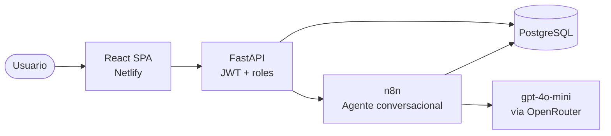

# 🐾 VetFlow

**Sistema de gestión de citas veterinarias con agente conversacional de IA.**

Un asistente que agenda, reprograma, cancela y consulta turnos por chat, sin esperar
a que una persona atienda el mensaje y sin ofrecer nunca un horario que ya esté tomado.

### 🔗 [Ver el sistema funcionando](https://voluble-bunny-6dcdbe.netlify.app/login)

> Podés crear una cuenta de cliente desde la misma pantalla.
> Para probar los paneles de administrador y de veterinario, pedile las credenciales al equipo.

---

## Qué hace

| Operación | Cómo funciona |
|---|---|
| **Agendar** | Elegís mascota, veterinario, fecha y horario. El sistema solo ofrece bloques libres. |
| **Reprogramar** | Movés un turno existente a otra fecha y hora. |
| **Cancelar** | Das de baja un turno y el horario queda liberado al instante. |
| **Consultar** | Ves tus turnos pendientes. |

Todo por chat, en lenguaje natural. En cualquier momento podés escribir `volver` para
retroceder un paso o `salir` para cerrar la conversación.

## Arquitectura

Tres capas con responsabilidades separadas: **React** presenta, **FastAPI** aplica las
reglas de acceso y **n8n** conduce la conversación. PostgreSQL es la única fuente de
verdad, y sostiene además la máquina de estados que le da memoria al chat.

## Stack

| Capa | Tecnologías |
|---|---|
| Frontend | React 19 · TypeScript · Vite · React Router 7 |
| Backend | FastAPI · SQLAlchemy 2 · PyJWT · bcrypt |
| Datos | PostgreSQL |
| Conversación | n8n · LangChain Agent · gpt-4o-mini (OpenRouter) |
| Despliegue | Netlify (frontend) · Easypanel/Docker (backend, n8n y base) |

## Roles

- **Cliente** — sus mascotas, sus turnos y el chat.
- **Veterinario** — su propia agenda y el historial clínico de los pacientes.
- **Administrador** — la agenda completa de la clínica y la gestión del equipo.

El control de acceso se aplica en el servidor: cada endpoint verifica el rol antes de
responder, de modo que ocultar una vista en el frontend nunca es la única barrera.

---

## Equipo

**Autores**
- Hernán Farfan
- Nicolás Romano

**Tutores a cargo**
- Alberto Cortez
- Ariel Enferrel

Proyecto final de carrera. La documentación completa —marco teórico, decisiones de
diseño, casos de prueba y anexos técnicos— está en la tesis que acompaña este repositorio.
